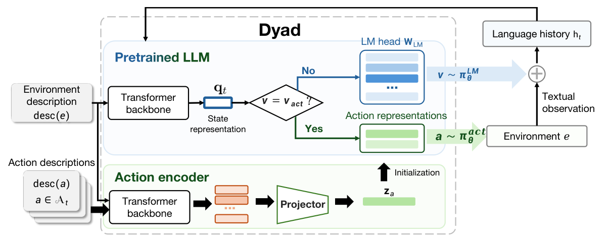

# Dyad: A Framework for Native Typed Decision-Making

<p align="center">
  <a href="https://arxiv.org/abs/2609.36116"></a>
  <a href="https://arxiv.org/pdf/2609.36116"></a>
  <a href="https://github.com/pingchuan-rookie/Dynamic_ExpA"></a>
  <a href="LICENSE"></a>
</p>

[Getting started](#getting-started) · [Citation](#citation)

**Dyad** is a framework for building, training, and evaluating LLM agents that combine language reasoning with native typed decision-making. It integrates action encoding, environment interaction, reinforcement learning, and inference on top of verl and vLLM.

An **environment-conditioned action encoder** represents available actions independently and in parallel. The language model uses its current interaction state to select among those actions, while retaining language generation for reasoning and arguments. Environment feedback then becomes part of the next interaction history.



*Overview from Figure 2 of the [paper](https://arxiv.org/pdf/2609.36116v1#page=3).*

## Framework overview

- **Native typed actions.** Agents select directly from the currently permissible actions, with representations constructed from descriptions to support dynamically provided action spaces.
- **Language reasoning.** The pretrained language model generates reasoning and any required arguments. Typed decisions and environment observations are incorporated into the same interaction history.
- **Reusable action encoding.** Action representations are computed separately from the evolving task history. They can be cached while the descriptions, environment context, and encoder parameters remain unchanged.
- **Shared interaction runtime.** Environment adapters, prompts, history, and rollout collection are shared across text baselines and typed-action policies.
- **Training and evaluation.** The framework provides action encoder alignment, GRPO/GiGPO training, checkpoint restoration, and evaluation of both agent performance and general language capabilities.

The action encoder contains a pretrained transformer backbone and a projector. Attention pooling is the default projector, and structured MCP-style descriptions are the default action inputs.

## Learning from environment interaction

Training begins with **Action Encoder Alignment**, followed by agentic reinforcement learning in either of two settings:

| Setting | Policy LLM | Encoder backbone | Projector | Objective |
|---|---|---|---|---|
| Action Encoder Alignment | Frozen | Frozen | Trainable | Cross-entropy on synthetic action-selection examples |
| Joint optimization | Trainable | Trainable | Trainable | GRPO or GiGPO from environment rewards |
| Frozen-LLM adaptation | Frozen | Trainable | Trainable | GRPO or GiGPO from environment rewards |

The alignment stage is named `action_encoder_alignment` in the code, with `actenc_alignment_*` files. It initializes the projector; frozen-LLM adaptation subsequently trains the **entire action encoder**, including its backbone.

The framework supports text ReAct baselines and Dyad's typed-action policy, with GRPO or GiGPO as the advantage estimator. All four combinations share environment interaction and task protocols:

| Method | Action interface | Advantage estimator | Public method name |
|---|---|---|---|
| GRPO | Text ReAct | GRPO | `grpo_react` |
| GiGPO | Text ReAct | GiGPO | `gigpo` |
| Dyad-GRPO | Dyad | GRPO | `dyad-grpo` |
| Dyad-GiGPO | Dyad | GiGPO | `dyad-gigpo` |

## Getting started

### Prepare CodeGym and Qwen3.5-4B

Run the training entrypoints from the repository root. The framework uses the local verl 0.9.0 source and vLLM, with dependencies prepared by [`setup_uv.sh`](setup_uv.sh) in `.venvs/expa-verl`. The setup requires [uv](https://docs.astral.sh/uv/getting-started/installation/), Linux, and NVIDIA CUDA GPUs.

Use `bash setup_uv.sh` as the installation entrypoint. Package metadata, dependencies and extras are declared in [`pyproject.toml`](pyproject.toml); the installer reads CUDA runtime pins from `ops/Dockerfile.dyad-verl`.

Before training, prepare:

- **CodeGym tasks and environment assets:** [dataset preparation](experiments/shared/dataset/README.md) and [environment setup](agent_system/environments/README.md).
- **Qwen3.5-4B model weights** and the [CodeGym model/hardware configuration](experiments/shared/train_eval/config/codegym.yaml). The commands below select `h100`.
- **A matching alignment projector for Dyad:** follow [Action Encoder Alignment](experiments/dyad_training/action_encoder_alignment/train_eval/README.md) and select the resulting `projector.pt` for Qwen3.5-4B. Text GRPO/GiGPO baselines do not require this checkpoint.

### Train on CodeGym

Choose the method to run. Both Dyad commands use Qwen3.5-4B with joint optimization:

```bash
ALIGNMENT_CKPT=/absolute/path/to/qwen3.5-4b-alignment/projector.pt

# Dyad-GRPO
bash experiments/dyad_training/agentic_rl/train_eval/train.sh codegym dyad-grpo \
  --model Qwen3.5-4B --hardware h100 \
  --projector-init "$ALIGNMENT_CKPT"

# Dyad-GiGPO
bash experiments/dyad_training/agentic_rl/train_eval/train.sh codegym dyad-gigpo \
  --model Qwen3.5-4B --hardware h100 \
  --projector-init "$ALIGNMENT_CKPT"
```

The corresponding text baselines use the same CodeGym environment:

```bash
# GRPO
bash experiments/grpo_training/train_eval/train.sh codegym \
  --model Qwen3.5-4B --hardware h100

# GiGPO
bash experiments/gigpo_training/train_eval/train.sh codegym \
  --model Qwen3.5-4B --hardware h100
```

Append `--check` to validate the selection and configuration before training. `--dry-run` additionally prepares the inputs needed to display the final command. Hardware settings are configuration presets; capacity must be checked on the target GPUs.

See the [training guide](experiments/shared/train_eval/README.md), [configuration reference](experiments/shared/train_eval/config/README.md), and [ablation settings](experiments/dyad_training/agentic_rl/train_eval/ablation/README.md) for additional options. Checkpoint evaluation is documented in the [shared evaluation guide](experiments/shared/train_eval/README.md); general-capability evaluation is described [here](experiments/capability_eval/README.md).

## Code organization

```text
agent_system/                         Shared environment interaction, policies, and model APIs
  inference/                          vLLM-powered inference for text and Dyad policies
  evaluation/                         Environment evaluation through the inference API
  policies/dyad/
    actions/                          Action schemas, candidates, routing, and replay
    models/                           Action encoder, projector, and action head
    rollout/                          Dyad generation backend and encoder synchronization
    training/                         Dyad engine/worker/loss and action_encoder_alignment
    inference/                        Checkpoint restoration and inference
verl/                                 Official verl backbone with marked integration points
verl_extensions/                      Shared GRPO/GiGPO, training stages, transport and config
experiments/
  action_encoder_alignment_dataset/   Alignment data preparation
  dyad_training/                      Alignment, agentic RL, and ablations
  grpo_training/                      Text GRPO entrypoint
  gigpo_training/                     Text GiGPO entrypoint
  shared/                            Shared datasets, training, evaluation, and analysis
  capability_eval/                    General-capability evaluation
agent_system/environments/env_package/ Versioned native environment packages and required source dependencies
docker/                               Unmodified upstream verl image definitions
ops/                                  Project images, DIVE sandbox and build tools
```

See [the experiment index](experiments/README.md) and [runtime overview](agent_system/README.md) for detailed responsibilities. The upstream verl introduction is retained in [README.verl.md](README.verl.md).

## Outputs

Set an absolute `ARTIFACT_ROOT` to choose the output location. Runs write weights under `ckpt/` and configurations, metrics, trajectories, and logs under `outputs/` within that directory. The default root is `artifacts/` in this repository.

See the [inference API](agent_system/inference/README.md) for model serving, the [training guide](experiments/shared/train_eval/README.md) for checkpoint handling, and [contribution checks](CONTRIBUTING.md) for source validation.

## Citation

```bibtex
@misc{zhan2026dyadextendinglargelanguage,
  title={Dyad: Extending Large Language Models with Native Typed Decision-Making},
  author={Yundaichuan Zhan and Weishi Wang and Wenbiao Liu and Daniel Dahlmeier and Chengwei Qin and Juncheng Li and Fredrik D. Johansson and Zhongqi Yue},
  year={2026},
  eprint={2609.36116},
  archivePrefix={arXiv},
  primaryClass={cs.LG},
  url={https://arxiv.org/abs/2609.36116}
}
```

## Acknowledgments

Built on [verl](https://github.com/verl-project/verl) and [vLLM](https://github.com/vllm-project/vllm), with GiGPO reference code from [verl-agent](https://github.com/langfengQ/verl-agent). Code is distributed under the [Apache 2.0 license](LICENSE).
